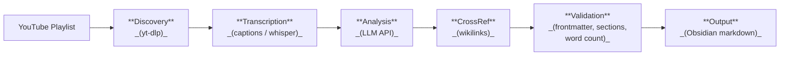

# civic-summary

Automated citizen-friendly summaries from government meeting videos.

civic-summary watches YouTube playlists for new government meeting recordings, transcribes them, generates plain-language summaries with a large language model, and outputs validated Obsidian-compatible markdown files — all driven by configuration, no code changes needed to add new government bodies.

Analysis runs over HTTP against any **Anthropic-compatible** or **OpenAI-compatible** endpoint, so you can use the first-party APIs, a gateway such as OpenRouter or Groq, or a model you host yourself with Ollama, vLLM, or LM Studio.

## How It Works



Each stage is independently runnable via CLI commands, or the full pipeline can be triggered with a single `process` command.

## Prerequisites

| Tool | Required | Install | Purpose |
|------|----------|---------|---------|
| Go 1.25+ | Yes | [go.dev/dl](https://go.dev/dl/) | Build the binary |
| yt-dlp | Yes | `brew install yt-dlp` | Download videos and captions |
| An LLM API key | Yes | [Anthropic](https://console.anthropic.com/) or [OpenAI](https://platform.openai.com/) | AI-powered meeting analysis. Any compatible endpoint works, including a local server. |
| Whisper | No | `brew install whisper-cpp` | Fallback when captions unavailable |
| golangci-lint | Dev only | `brew install golangci-lint` | Code linting |

## Quick Start

1. **Clone the repository**
   ```bash
   git clone https://github.com/AvogadroSG1/civic-summary.git
   cd civic-summary
   ```

2. **Check prerequisites**
   ```bash
   make check
   ```

3. **Run initial setup**
   ```bash
   make setup
   ```
   This creates `~/.civic-summary/` with a starter config copied from `config.example.yaml`.

4. **Export your API key**
   ```bash
   export ANTHROPIC_API_KEY=sk-ant-...   # or OPENAI_API_KEY for an OpenAI-compatible endpoint
   ```
   The key is read from the environment, never from the config file.

5. **Edit your configuration**
   ```bash
   $EDITOR ~/.civic-summary/config.yaml
   ```
   Set `output_dir` to where you want summaries written, pick a model in the `llm` block, and configure at least one government body. See [Configuration Reference](#configuration-reference) below.

6. **Add a prompt template**
   ```bash
   cp templates/hagerstown.prompt.tmpl ~/.civic-summary/templates/my-council.prompt.tmpl
   # Edit the template to match your body's meeting structure
   ```
   See [docs/prompt-template-guide.md](docs/prompt-template-guide.md) for customization details.

7. **Build and verify**
   ```bash
   make build
   ./civic-summary status                       # confirms the model is reachable
   ./civic-summary discover --body=my-city-council
   ```

## Adding Your Own Government Body

No code changes needed. You need two things: a config block and a prompt template.

### Step 1: Find the YouTube Playlist ID

Go to the YouTube channel for your government body and find the playlist containing meeting recordings. The playlist ID is in the URL:

```
https://www.youtube.com/playlist?list=PLxxxxxxxxxxxxxxxxxxxxxxxxxxxxxxxxxx
                                      ^^^^^^^^^^^^^^^^^^^^^^^^^^^^^^^^^^^
                                      This is the playlist_id
```

Alternatively, if meetings are posted as live streams, use `video_source_url` with the channel's streams page.

### Step 2: Determine the Date Regex

Look at how video titles are formatted and write a regex whose first capture group extracts the date:

| Title Format | Regex |
|-------------|-------|
| `January 15, 2025 - City Council Meeting` | `'^([A-Z][a-z]+ \d{1,2},? \d{4})'` |
| `Council Meeting - January 15, 2025` | `'- ([A-Z][a-z]+ \d{1,2}, \d{4})$'` |
| `2025-01-15 Regular Session` | `'^(\d{4}-\d{2}-\d{2})'` |

### Step 3: Create a Prompt Template

Copy an existing template and customize it for your body's meeting structure:

```bash
cp templates/hagerstown.prompt.tmpl ~/.civic-summary/templates/my-council.prompt.tmpl
```

See [docs/prompt-template-guide.md](docs/prompt-template-guide.md) for the full template variable reference.

### Step 4: Add the Config Block

Add a new entry under `bodies:` in `~/.civic-summary/config.yaml`. See [config.example.yaml](config.example.yaml) for a fully documented example.

### Step 5: Test

```bash
# Verify config parses correctly
./civic-summary bodies list

# Check for discoverable videos
./civic-summary discover --body=my-council

# Dry-run the full pipeline
./civic-summary process --body=my-council --dry-run
```

## CLI Reference

| Command | Description | Example |
|---------|-------------|---------|
| `process` | Run the full 5-stage pipeline | `civic-summary process --body=hagerstown` |
| `process --all` | Process all configured bodies | `civic-summary process --all` |
| `process --dry-run` | Preview without executing | `civic-summary process --body=bocc --dry-run` |
| `discover` | Phase 1: Find unprocessed videos | `civic-summary discover --body=hagerstown` |
| `transcribe <video-id>` | Phase 2: Get transcript for a video | `civic-summary transcribe abc123 --body=hagerstown` |
| `analyze <video-id>` | Phase 3: Generate summary from transcript | `civic-summary analyze abc123 --body=hagerstown --date=2025-02-04` |
| `crossref <file>` | Phase 4: Add Obsidian wikilinks | `civic-summary crossref summary.md --body=hagerstown --date=2025-02-04` |
| `validate <file>` | Phase 5: Check quality requirements | `civic-summary validate summary.md --body=hagerstown` |
| `bodies list` | List configured bodies | `civic-summary bodies list` |
| `bodies show <slug>` | Show body details | `civic-summary bodies show hagerstown` |
| `status` | Show processing status and check the model is reachable | `civic-summary status --body=hagerstown` |
| `quarantine list` | List failed meetings | `civic-summary quarantine list --body=hagerstown` |
| `quarantine retry` | Retry failed meetings | `civic-summary quarantine retry --body=hagerstown` |
| `quarantine remove <id>` | Remove from quarantine | `civic-summary quarantine remove abc123 --body=hagerstown` |
| `version` | Print version info | `civic-summary version` |
| `completion` | Generate shell completions | `civic-summary completion zsh` |

**Global flags:** `--config <path>` (custom config file), `--verbose` / `-v` (debug output)

## Choosing a Model

The `llm` block selects the provider, model, and endpoint. `provider` names a wire
protocol rather than a vendor, so each one covers many services:

| Provider | Endpoint | Works with |
|----------|----------|------------|
| `anthropic` | `POST /v1/messages` | The Anthropic API, and any Anthropic-compatible gateway |
| `openai` | `POST /v1/chat/completions` | The OpenAI API, Azure OpenAI, OpenRouter, Groq, Together, Ollama, vLLM, LM Studio, and other compatible servers |

```yaml
# Anthropic API (the default)
llm:
  provider: anthropic
  model: claude-opus-5

# A local model served by Ollama
llm:
  provider: openai
  model: llama3.3
  base_url: http://localhost:11434/v1
  api_key_env: OLLAMA_API_KEY      # Ollama ignores the value, but one must be set
  max_tokens_field: max_tokens     # older servers do not accept max_completion_tokens
```

Any body can override the global block, which is useful when one body's meetings
need a larger context window than the rest:

```yaml
bodies:
  my-county-bocc:
    # ...
    llm:
      model: claude-sonnet-5
      max_tokens: 32000
```

Run `civic-summary status` to confirm the resolved model is reachable before
starting a run. It sends one minimal request per body; `--skip-llm-check` stays
offline.

> **Note on `temperature`:** leave it unset. Current Claude models (Opus 5,
> Sonnet 5, Opus 4.8/4.7) reject sampling parameters with HTTP 400.

## Configuration Reference

See [`config.example.yaml`](config.example.yaml) for a fully commented example with all fields.

**Config file search order:**
1. `--config` flag (if provided)
2. `~/.civic-summary/config.yaml`
3. `./config.yaml` (for development)

**Environment variable overrides** use the `CIVIC_SUMMARY_` prefix:

| Variable | Config Field |
|----------|-------------|
| `CIVIC_SUMMARY_OUTPUT_DIR` | `output_dir` |
| `CIVIC_SUMMARY_LOG_RETENTION_DAYS` | `log_retention_days` |
| `CIVIC_SUMMARY_MAX_RETRIES` | `max_retries` |
| `CIVIC_SUMMARY_YTDLP` | `tools.ytdlp` |
| `CIVIC_SUMMARY_WHISPER` | `tools.whisper` |
| `CIVIC_SUMMARY_WHISPER_MODEL` | `tools.whisper_model` |
| `CIVIC_SUMMARY_LLM_PROVIDER` | `llm.provider` |
| `CIVIC_SUMMARY_LLM_MODEL` | `llm.model` |
| `CIVIC_SUMMARY_LLM_BASE_URL` | `llm.base_url` |
| `CIVIC_SUMMARY_LLM_API_KEY_ENV` | `llm.api_key_env` |
| `CIVIC_SUMMARY_LLM_MAX_TOKENS` | `llm.max_tokens` |
| `CIVIC_SUMMARY_LLM_MAX_TOKENS_FIELD` | `llm.max_tokens_field` |

The API key itself is never read from the config file. `llm.api_key_env` names the
environment variable to read it from, defaulting to `ANTHROPIC_API_KEY` or
`OPENAI_API_KEY` depending on the provider.

### Upgrading from the Claude CLI

Earlier versions shelled out to the `claude` CLI and configured it with
`tools.claude`. Analysis now goes over HTTP, so:

1. Delete `tools.claude` from your config — it is no longer read.
2. Add an `llm` block (or accept the defaults, which use the Anthropic API with
   `claude-opus-5`).
3. Export an API key: `export ANTHROPIC_API_KEY=sk-ant-...`. A Claude Code
   subscription does not cover API access; get a key from the
   [Anthropic Console](https://console.anthropic.com/).
4. Run `civic-summary status` to confirm the new setup.

The `claude` CLI is no longer a prerequisite.

## Scheduling (macOS)

A launchd plist is provided in `support/launchd/` for automated weekly processing. See `support/launchd/install.sh` for setup instructions.

## Architecture

```
cmd/                    # Cobra CLI commands
internal/
  config/               # Viper config loading, validation, env binding
  domain/               # DDD types: Meeting, Body, Transcript, Summary
  executor/             # Commander interface for shelling out to tools
  llm/                  # Anthropic- and OpenAI-compatible model clients
  markdown/             # Frontmatter parsing, sanitization, wikilinks
  output/               # Logging, terminal formatting, notifications
  retry/                # Generic retry with exponential backoff
  service/              # Pipeline services (one per stage) + orchestrator
templates/              # Go text/template prompt files
testdata/fixtures/      # Golden test data
docs/                   # Architecture docs and ADRs
support/                # Deployment helpers (launchd)
```

For a deeper dive, see [docs/architecture.md](docs/architecture.md) and the [ADRs](docs/adr/).

## Development

```bash
make build      # Build binary with version info
make test       # Run all tests
make lint       # Run golangci-lint
make coverage   # Generate HTML coverage report
make check      # Verify prerequisites are installed
make setup      # First-time dev environment setup
make clean      # Remove build artifacts
make release    # Local snapshot release (goreleaser)
```

See [CONTRIBUTING.md](CONTRIBUTING.md) for the full development guide.

## License

[MIT](LICENSE)
