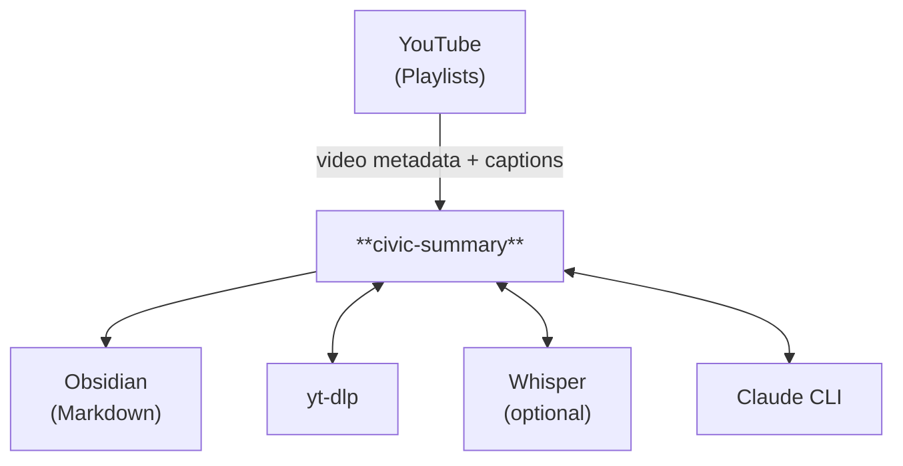
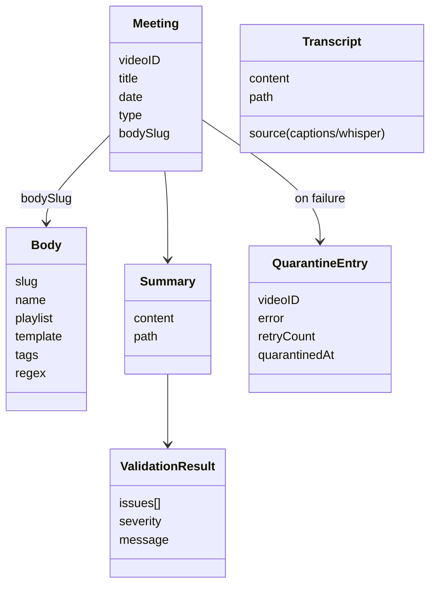

# Architecture

This document describes the internal architecture of civic-summary for contributors who want to understand or extend the system.

## System Context



civic-summary is a CLI tool that coordinates three external tools:

- **yt-dlp** — Downloads video metadata and captions from YouTube playlists
- **Whisper** (optional) — Transcribes audio when captions are unavailable
- **Claude CLI** — Generates citizen-friendly summaries from transcripts

Output is Obsidian-compatible markdown with YAML frontmatter and wikilinks.

## Pipeline Deep Dive

The pipeline has five sequential stages. Each stage can run independently via its own CLI command, or all five run together via `civic-summary process`.

### Stage 1: Discovery

| | |
|---|---|
| **Purpose** | Find YouTube videos that haven't been processed yet |
| **Service** | `internal/service/discovery.go` |
| **Executor** | `internal/executor/ytdlp.go` |
| **Input** | Playlist ID or channel URL (from body config) |
| **Output** | `[]domain.Meeting` — list of meetings to process |
| **Failure** | Fatal — cannot proceed without video list |

Queries yt-dlp for flat playlist metadata, parses video titles to extract meeting dates using the body's `title_date_regex`, then filters out videos that already have finalized summaries on disk.

### Stage 2: Transcription

| | |
|---|---|
| **Purpose** | Obtain an SRT-format transcript for each meeting |
| **Service** | `internal/service/transcription.go` |
| **Executor** | `internal/executor/ytdlp.go`, `internal/executor/whisper.go` |
| **Input** | `domain.Meeting` |
| **Output** | `domain.Transcript` (content + source + path) |
| **Failure** | Fatal — cannot analyze without transcript |

First attempts to download auto-generated captions via yt-dlp. If no captions are available and Whisper is configured, downloads the audio and runs Whisper for local transcription.

### Stage 3: Analysis

| | |
|---|---|
| **Purpose** | Generate a citizen-friendly markdown summary |
| **Service** | `internal/service/analysis.go` |
| **Executor** | `internal/executor/claude.go` |
| **Input** | `domain.Meeting` + `domain.Transcript` + `domain.Body` |
| **Output** | `domain.Summary` (raw markdown content) |
| **Failure** | Fatal — the core value of the pipeline |

Renders the body's prompt template with meeting data and transcript, then sends it to Claude CLI via stdin. The response is sanitized to remove any meta-commentary preamble Claude may add before the frontmatter.

### Stage 4: Cross-Reference

| | |
|---|---|
| **Purpose** | Inject Obsidian `[[wikilinks]]` to adjacent meetings |
| **Service** | `internal/service/crossref.go` |
| **Input** | Summary content + meeting date + body config |
| **Output** | Summary content with wikilinks added |
| **Failure** | Non-critical — summary is valid without links |

Scans the finalized summaries directory for chronologically adjacent meetings and inserts wikilinks. This enables navigation between meeting summaries in Obsidian.

### Stage 5: Validation

| | |
|---|---|
| **Purpose** | Verify summary meets quality requirements |
| **Service** | `internal/service/validation.go` |
| **Input** | Final summary content + body config |
| **Output** | `domain.ValidationResult` (errors + warnings) |
| **Failure** | Fatal on errors, pass on warnings |

Checks:
- Valid YAML frontmatter with required fields
- All required sections present (Updates, Citizen Comments, Actions Taken, etc.)
- Minimum word count
- Timestamp format compliance
- No Claude meta-commentary leaking through

## Domain Model



- **Body** — A government entity (e.g., city council). Loaded from config. Immutable at runtime.
- **Meeting** — The aggregate root. A single government meeting identified by a YouTube video.
- **Transcript** — Value object containing the SRT text. Tracks whether it came from captions or Whisper.
- **Summary** — Value object for the generated markdown document.
- **ValidationResult** — Aggregates validation issues, distinguishing errors (hard fail) from warnings (advisory).
- **QuarantineEntry** — Metadata for a meeting that failed processing, enabling structured retry.

## Runtime Directory Layout

When civic-summary processes meetings, it creates the following structure under `output_dir`:

```
output_dir/
└── {body.output_subdir}/
    ├── Finalized Meeting Summaries/
    │   ├── index.md                          # Auto-generated meeting index
    │   ├── 20250204/
    │   │   ├── abc123.srt                    # Cached transcript
    │   │   └── Body-Name-2025-02-04-Citizen-Summary.md
    │   └── 20250218/
    │       ├── def456.srt
    │       └── Body-Name-2025-02-18-Citizen-Summary.md
    └── Automation/
        ├── logs/                             # Processing logs
        └── quarantine/                       # Failed meetings
            └── {video_id}/
                └── metadata.json             # Error details for retry
```

## Testability Design

The codebase achieves high test coverage (87%, 119 tests) without requiring any external tools to be installed.

### The Commander Interface

Every shell command goes through the `Commander` interface:

```go
type Commander interface {
    Execute(ctx context.Context, name string, args ...string) (*CommandResult, error)
    ExecuteWithStdin(ctx context.Context, stdin string, name string, args ...string) (*CommandResult, error)
}
```

**In production**, `OsCommander` executes real OS commands via `os/exec`.

**In tests**, `MockCommander` returns pre-configured responses:

```go
mock := executor.NewMockCommander()
mock.OnCommand("yt-dlp --flat-playlist ...", &executor.CommandResult{
    Stdout: fixtureData,
}, nil)
```

This pattern means:
- Tests are fast (no subprocess overhead)
- Tests are deterministic (no network, no file system side effects)
- Tests can simulate error conditions (set up error responses)
- Tests verify command construction (mock records all calls)

### Service Layer Isolation

Each pipeline stage is a separate service with its own constructor. Services depend on executors (via the Commander interface), not on each other. The `PipelineOrchestrator` wires them together, but each service is independently testable.
